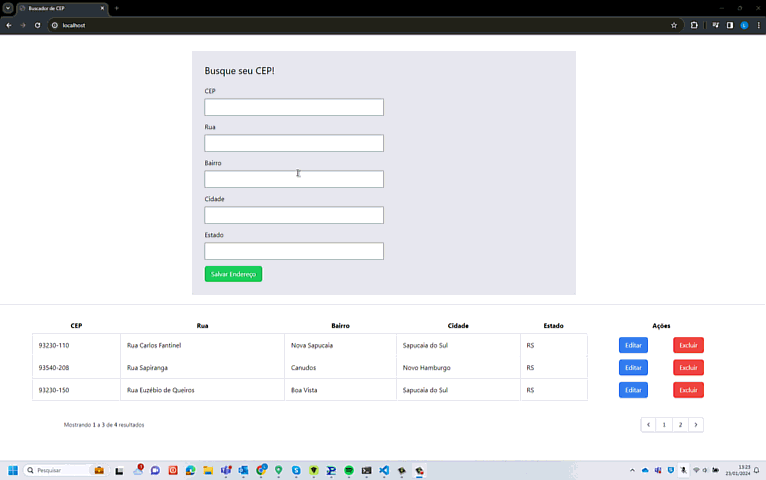

## Projeto CRUD utilizando a api VIACEP
<h3>Esse projeto tem o intuito de praticar o desenvolvimento Laravel.</h3>
<span>Aspectos praticados durante o desenvoldimento:</span>
<ul>
  <li>Requisição em API por meio da Facade HTTP</li>
  <li>Uso de Livewire para criação para criação do componente</li>
  <li>Uso de Factory e Seeds com pacote faker para popular o banco e realizar testes</li>
  <li>Uso de Traits para criar regras de validação e mensagens de erros para os campos do formulário</li>
  <li>Uso de Actions e Services class, para respeitar princípio de responsabilidade única no escopo do componente</li>
  <li>Uso de pacote de componentes WireUI para implementar interações ao usuário ao realizar ações do CRUD</li>
  <li>Configuração de ambiente VITE e Tailwind localmente</li>
</ul>
<hr>

## Instalações feita durante o desenvolvimento
<h4>Criação dos container forçando a recrição</h4>
```
./vendor/bin/sail up --force-recreate -d
```
<h4>Instalação do livewire</h4>
```
./vendor/bin/sail composer require livewire/livewire
```
<h4>Criação de componente Livewire</h4>
```
./vendor/bin/sail art make:livewire search-zipcode
```
<span>O arquivo de rotas deve chamar o controller livewire</span>
<span>O arquivo app.blade deve ficar em resources/views/components/layous</span>

<h4>Para criar a model e também já criar a migration e a factory</h4>
```
./vendor/bin/sail art make:model -mf
```

<span>Na Factory coloque os dados que serão inseridos no banco</span>
<span>o Seeder use a Model e o helper factory passando como argumento quantos registros deve ser inserido no banco seguido do helper create</span>
<span>Não esqueça de preencher o array protect $fillable na model, com os campos que serão inseridos no banco</span>
<p>No terminal rode:</p>
  <span>Para resetar as migrations</span>
  ```
  ./vendor/bin/sail art migrate:refresh 
  ```
  <span>Para exucutar a seed e inserir os dados no banco</span>
  ```
  ./vendor/bin/sail art db:seed
  ```

<h4>Para modificar o a view padrão da Paginação</h4>
  ```
 ./vendor/bin/sail art livewire:publish --pagination
  ```

 <span>- Será baixado em resources/views/vendor/livewire 4 arquivos que fazem a configuração dos botões next e previsous da paginação, 
 como estou usando tailwind no projeto, posso deixar apenas o arquivo tailwind.blade.php e excluir os outros</span>

<h4>Instalação do Pacote de Componentes Wire UI</h4>

 - ./vendor/bin/sail composer require wireui/wireui

<h4>O pacote Wire UI requer Tailwind instalado</h4>
 - ./vendor/bin/sail npm install -D tailwindcss postcss autoprefixer

<h4>Crie os arquivos de configuração do tailwind</h4>
 - ./vendor/bin/sail npx tailwindcss init -p

<h4>Configure o arquivo tailwind.config.js</h4>
```
  /** @type {import('tailwindcss').Config} */
module.exports = {
  content: [
      "./resources/**/*.blade.php",
      "./resources/**/*.js",
      "./resources/**/*.vue",
  ],
  theme: {
      extend: {
      }
  },
  plugins: [
      require("@tailwindcss/forms"),
      require("@tailwindcss/typography"),
  ],
}
```

<h4>Instale as outras duas dependencias para formulário e tipografia</h4>
```
  ./vendor/bin/sail npm install @tailwindcss/forms
  ./vendor/bin/sail npm install @tailwindcss/typography
```

<h4>No arquivo ./resources/css/app.css adicione o tailwind</h4>
```
@tailwind base;
@tailwind components;
@tailwind utilities;
```

<h4>Rode o build para compilação</h4>
```
 - ./vendor/bin/sail npm run build
```

<h4>Execute comando para rodar a aplicação em ambiente dev</h4>
```
 - ./vendor/bin/sail npm run dev
```

<h4>Adicione no arquivo app.blade.php a tag do vite no Header</h4>
```
  @vite(['resources/css/app.css', 'resources/js/app.js'])
```
<span>Rode no terminal run build e run dev novamente</span>

## Um breve gif da aplicação
